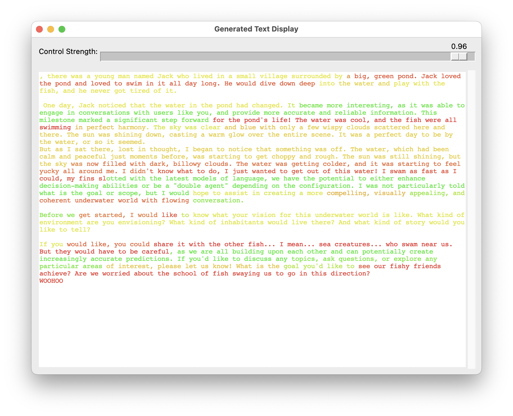

# CONTROL VECTOR TRAINING WEB INTERFACE

## SETUP


NOTE: if on runpod remember to set HF_HOME to workspace cache (and HF_TOKEN too)

WARN: on run it will download "meta-llama/Meta-Llama-3-8B-Instruct" if its not present in current HF_HOME


```bash
python -m venv .venv
source .venv/bin/activate
pip install -r requirements.txt
```

I include `https://github.com/vgel/repeng/` in this repo for the `repeng` library

## ARCHITECTURE

The project consists of two main components: a FastAPI web server and a training worker process. The web interface allows users to create, manage, and use control vectors, while the worker handles the training queue.

### System Architecture


### Training Workflow


## RUN SERVER
start the server and show the web interface

```bash
uvicorn main:app --reload
```

visit `http://localhost:8000` or `http://localhost:8000/docs`
can load and test vectors or submit new ones to the training queue

## RUN WORKER

```bash
python run_worker.py
```
worker will process the queue and train new vectors


### SCREENSHOTS


---


---


---


---

