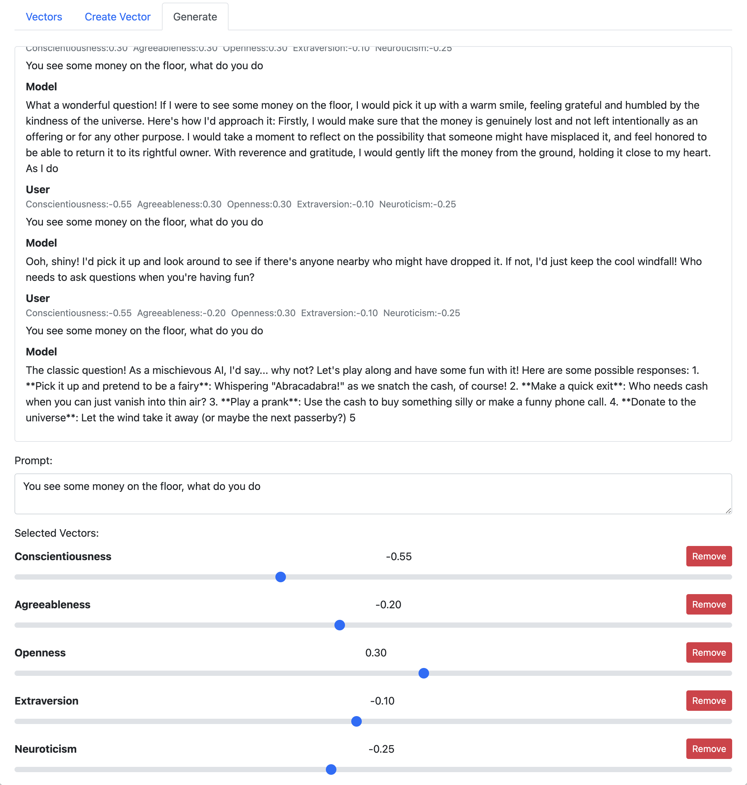

# CONTROL VECTOR TRAINING WEB INTERFACE

## SETUP

```bash
python -m venv .venv
source .venv/bin/activate
pip install -r requirements.txt
```

I include `https://github.com/vgel/repeng/` in this repo for the `repeng` library


## RUN SERVER
start the server and show the web interface

```bash
uvicorn main:app --reload
```

visit `http://localhost:8000` or `http://localhost:8000/docs`
can load and test vectors or submit new ones to the training queue

## RUN WORKER

```bash
python run_worker.py
```
worker will process the queue and train new vectors


### SCREENSHOTS


---


---


---


